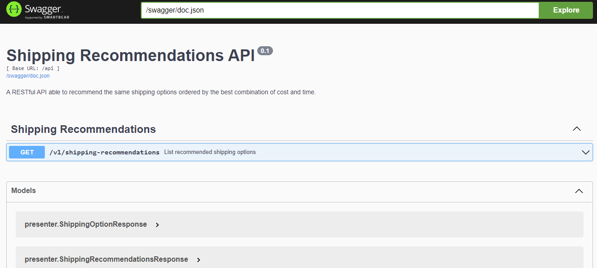

[](https://goreportcard.com/report/github.com/bosamatheus/better-shipping/shipping-recommendations)
[](http://localhost:8080/swagger/index.html)

# Shipping Recommendations API

RESTful API that given different shipping options from an **external API** is able to recommend the same shipping options ordered by the best combination of cost and time.

## Architecture

Shipping Recommendations API architecture is based on the Clean Architecture.


## Execution

### Running the API

You can run the API with the following command:

```shell
make run
```

### Linting

To lint the API using golangci-lint, execute:

```shell
make lint
```

### Testing

To test the API you can use the following command:

```shell
make test
```

And if you want to get coverage information, you can use:

```shell
make test-cover
```

To update mocks, use this command:

```shell
make build-mocks
```

## Documentation

### Swagger

You can find the documentation of the API at [localhost:8080/swagger/index.html](http://localhost:8080/swagger/index.html).



### Examples

- **List recommended shipping options**

Request:

```shell
curl -X 'GET' \
  'http://localhost:8080/api/v1/shipping-recommendations'
```

Response:

```json
{
  "shipping_recommendations": [
    {
      "name": "Option 2",
      "type": "Custom",
      "cost": 5,
      "estimated_days": 4
    },
    {
      "name": "Option 3",
      "type": "Pickup",
      "cost": 7,
      "estimated_days": 1
    },
    {
      "name": "Option 4",
      "type": "Delivery",
      "cost": 10,
      "estimated_days": 3
    },
    {
      "name": "Option 1",
      "type": "Delivery",
      "cost": 10,
      "estimated_days": 5
    }
  ]
}
```

## Dependencies

- Golang 1.17 (https://go.dev)
- Fiber v2: web framework (https://gofiber.io)
- Viper: environment variables (https://github.com/spf13/viper)
- Testify: testing (https://github.com/stretchr/testify)
- Mockery: mocks generator (https://github.com/vektra/mockery)
- Logrus: logging (https://github.com/sirupsen/logrus)
- golangci-lint: linter (https://golangci-lint.run)
- swag: Swagger documentation generator (https://github.com/swaggo/swag)
- fiber-swagger: Swagger middleware for Fiber (https://github.com/arsmn/fiber-swagger)
